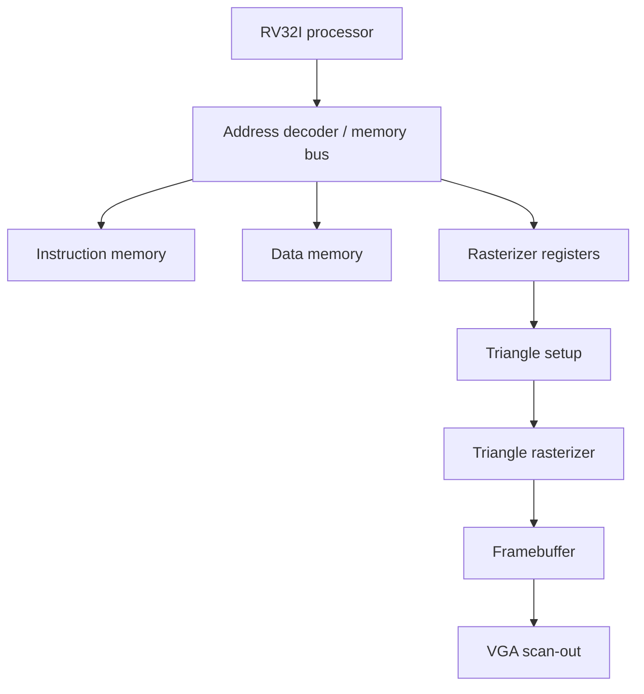

# RISC-V-SoC-integrated-with-Fixed-Function-Triangle-Rasterizer

A SystemVerilog implementation of a small RV32I system-on-chip with a memory-mapped, fixed-function triangle rasterizer. The project targets the Digilent Basys 3 FPGA and displays rasterized graphics through VGA.

## Current capabilities

- Single-cycle RV32I processor core
- Arithmetic, logical, load, store, branch, and jump instructions
- Separate instruction and data memories
- Memory-mapped rasterizer control registers
- Triangle bounding-box generation
- Edge-equation triangle coverage testing
- Top-left edge rule for consistent shared edges
- Incremental pixel traversal within a triangle's bounding box
- 12-bit RGB framebuffer writes
- VGA scan-out
- Multiple sequential triangle submissions
- Test programs loaded from a `.mem` file

## System architecture



The processor submits triangle vertices and colors by writing to memory-mapped registers. A start write launches the accelerator. Triangle setup calculates the clipped bounding box and edge equations, and the rasterizer tests each pixel in that box. Covered pixels are written to the framebuffer and later read by the VGA subsystem.

## Target hardware

- Digilent Basys 3
- Xilinx Artix-7 FPGA
- 100 MHz board clock
- VGA output at 640 × 480 timing
- Internally scaled framebuffer resolution, if enabled by the top-level design
- 12-bit RGB output: 4 bits each for red, green, and blue

## Program memory format

Instruction memory is initialized from a plain hexadecimal memory file containing one 32-bit instruction per line:

```text
400000B7
00200113
0020A423
0000006F
```

The final instruction may use an infinite loop, such as `jal x0, 0`, to stop execution from continuing into uninitialized memory.

## Project status

The RV32I core, rasterizer pipeline, framebuffer, and VGA path have been integrated and exercised in simulation. Current work focuses on test programs that submit multiple triangles, including a three-iteration Sierpiński triangle, followed by verification on the Basys 3.

## Future improvements

- Double buffering to prevent visible tearing
- Depth buffering
- Per-vertex color interpolation
- Additional rasterizer commands and status registers
- Automated regression tests
- RISC-V assembly build scripts
- Performance counters
- Pipelined or multi-cycle CPU improvements

## Why this project?

This design is a compact demonstration of how a processor and specialized graphics hardware can cooperate inside an FPGA. It is not a general-purpose GPU or an OpenGL implementation; it is a small graphics accelerator focused on filled-triangle rasterization.

## Author

Zayaan Khandakar  
Electrical Engineering student focused on FPGA systems, digital hardware, embedded software, and PCB design.
